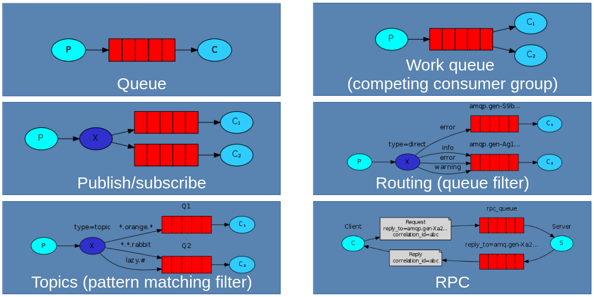
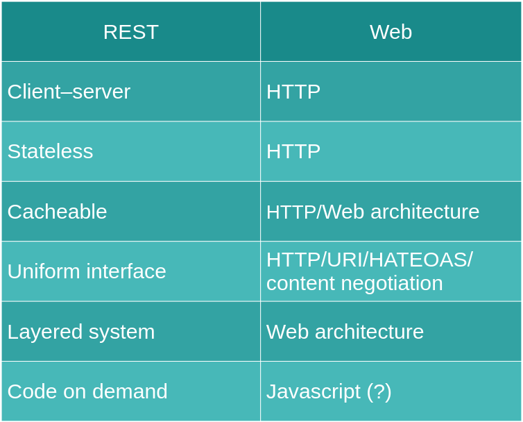
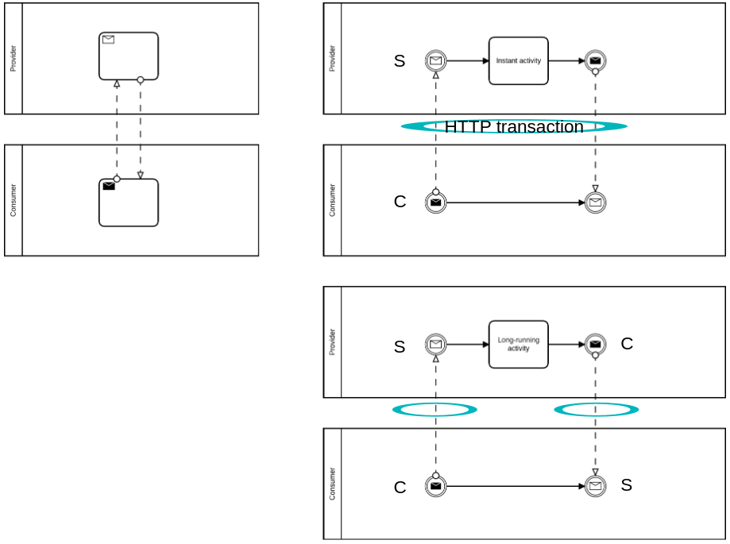
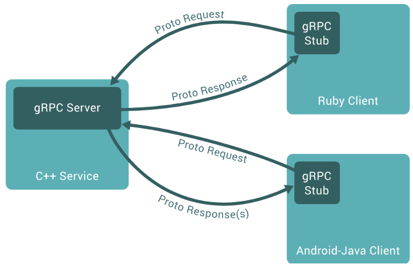

# 10. Servizi di comunicazione

## Stili di comunicazione
Servizi che dentro un'applicazione vogliono comunicare fra di loro lo possono fare usando due diversi stili in base al suo indirizzamento:
- Esplicito: prendi l'indirizzo e scambi messaggi, RPC (Remote Procedure Call). Si fa in modo sync (richiesta e risposta effettuai sullo stesso canale di comunicazione) o async (la risposta usa un canale di comunicazione diverso, vedesi richieste che attivano procedure di calcolo lunghe). Un altro modo è l'uso dello streaming: si apre un unico canale di comunicazione in cui si fanno più richieste e/o più risposte (eg: ogni secondo una risposta per la temperatura di un luogo). 
- Implicito: i messaggi vengono indirizzati mediante un intermediario. Possono utilizzare code (comunicazione punto-punto), canali pub/sub (topic non persistenti) e log (persistenti): i primi due sono chiamati message broker, gli ultimi due sono event-driver.

### Architettura event-driven
Si hanno dei componenti ben identificati: producer e consumer. Essi sono disaccoppiati, non si hanno certezza gli uni degli altri.
- Modello pub/sub: i consumer (sub) ricevono i dati dati dai producer (pub) una volta iscritti ad un generico topic.
- Event streaming model (log): i clienti chiedono accesso allo stream e dunque ai log, poi son sempre loro a decidere quando andare avanti/indietro nel tempo. Infatti non è proprio una sottoscrizione come nel pub/sub.

### Message broker
Vi sono diverse architetture su come costruirlo in base a garanzie, distribuzioni o altro.



## REST
Stile architetturale che definisce insieme di componenti e connettori e come questa composizione viene luogo mediante dei **vincoli**. 

> Lo stile architetturale è definito dai suoi vincoli.

1. L'interazione viene fatta tra client-server: pattern richiesta-risposta
2. Un server può ricevere diverse richieste ed ognuna è servita come se fosse un client nuovo: stateless.
3. Le richieste possono fare caching.
4. L'interfaccia del dialogo è uniforme: ogni servizio espone la stessa interfaccia.
5. Il sistema è organizzato a livelli.
6. Code on demand (opzionale)

Un load balancer è un gateway, il proxy invece è esplicitato dal client.

Il web soddisfa questi vincoli architetturali.


Richardson Maturity Model definisce quanto un'applicazione fa effettivamente uso di REST. 
0. Tutti i modelli che usano HTTP, come SOAP, sono solo al livello 0.
1. Nel livello 1 si distinguono le risorse e le operazioni dagli url. 
2. Nel livello 2 definisce come le operazioni sulle risorse vengano specificate mediante i verbi HTTP (metodi POST, GET, etc.). Le interfacce sono i percorsi. 
3. Nel livello 3 si definisce HATEOAS (hypermedia as the engine of application state): il client dialoga col server in modo machine-to-machine messaggiando nel medesimo modo in cui client umani lo fanno sul sito (usando link): in parole brevi, le risorse sono collegati medianti url mnemonici che possono essere scoperti dal client.

Le API basate sui percorsi e non sui link, non sono RESTful.

### REST in SOA
REST non scarica al client compiti di calcolo pesanti ma non funziona sempre. Vi sono vincoli come: modello solo richiesta/risposta, nessuna call async (le webhook non è che siano tanta roba), niente messaggi pub/sub, nessuno standard per cryptazione (si usa TLS al massimo), nessun meccanismo di reliable messaging (TCP è best effort ma non vi sono garanzie rispetto a generazione/consegna di messaggi), nessuna transazione distribuita (web è scalabile ma le garanzie di isolamento, persistenza etc. sono meccanismi che si basano su locking ma fanno calare il livello di persistenza del sistema), nessun meccanismo di concorrenza, nessun contratto (nessun linguaggio standard delle interfacce, i vari WSDL, OAS e RAML non sono standard).
REST si può usare in SOA ma non fa quello per cui è così diffuso perché i client si appesantiscono.

#### Modello richiesta/risposta
Rimanendo in ambiente RESTful, e quindi niente web socket, si possono fare le web hook in cui ci si registra ad un service provider per un determinato servizio. Questo viene gestito mediante meccanismi asincroni. Si registra un proprio endpoint ad esempio "quando arriva un determinato ordine avvisami" e lì il server tramite anche meccanismi pub/sub gestisce la cosa e il client pertanto deve essere capace di ricevere messaggi mettendo su un piccolo "server HTTP".
Il dialogo richiesta-risposta può essere rappresentato in BPMN come


e qui si può gestire anche il tempo di risposta. Nel caso di richieste lunghe si può, per l'appunto, gestire due transazioni con sistema web-hook con piccolo server HTTP nel client (caso più diffuso).

### Proprietà dei metodi
Un metodo `safe` non modifica lo stato del service provider: si invocano quei metodi in qualunque ordine e modo.
Un metodo `idempotente` definisce lo stesso risultato nel caso di due invocazioni uguali (eg: setta il conto corrente a 150€, non lo è il prelievo).

|   | Safe  | Idempotente  |
|---|---|---|
|GET   | sì  | sì  |
|POST|   |  |
|PUT|   |  sì |
|DELETE|   |  sì |

Prendendo ad esempio il "prelievo di 100€" se la POST generasse un errore non si saprebbe se l'errore è stato nel caso di prelievo o solo in fase di risposta. Per aggirare questo problema si usano dei pattern in modo da processare la richiesta POST una sola volta. Si spezza la richiesta in due fasi:
1. richiesta GET ad un endpoint di una richiesta one-shot in cui è possibile inviare un messaggio a quella risorsa effimera (non più valida dopo il primo uso).
2. richiesta POST all'endpoint.

Vi sono diversi possibili errori (circa 6) in queste due chiamate. Se fallisce la prima richiesta GET non è un problema: avremo un nuovo endpoint, tanto è idempotente. Se fallisce la POST possono succede due casi e comunque si farà un *retry* finché non funziona: se la risposta è `202 Accepted` vuol dire che è stata processata una volta sola, perché in caso contrario si avrebbe la risposta `405 - Operation not permitted` che afferma che la risposta è stata già processata.

Vi è un pattern più semplice che si basa anch'esso su risorse virtuali intermedie in cui si fa una richiesta POST che ritorna un URI ad una risorsa effimera a cui si accede mediante una PUT. La PUT non fa altro che confermare la creazione. Chiaramente le risorse create da POST hanno un timeout che "cancella" (tecnicamente non sono ancora state create ufficialmente) i dati se non vengono confermate dal PUT. Un esempio di flusso può essere
`POST /factory` che ritorna `/resources/xyz`
`PUT /resources/xyz`

Quando la creazione della risorsa è lenta nella creazione, non va bene una semplice richiesta HTTP perché (1) la connessione va in timeout e (2) non hai la risposta in cui è stata ubicata tale risorsa. Un pattern d'uso classico è 
```
POST /job
202 Accepted
Location: /job/42

GET /job/42
200 OK

"oppure"

GET /job/42
303 See Other
Location: /job/42/output
```
finché è 200 vuol dire che la risorsa non è stata creata, dunque non polling poi si procederà nell'url reale della risorsa appena creata.

Un modo nativo da HTTP `ETag` può essere usato per dei problemi possibili di concorrenza (es. di aggiornamento del conto corrente). `ETag` è un hash del contenuto della risorsa.
```
GET /account/xyz/amount
200 - OK
ETag: qwerty

PUT /account/xyz/amount
If-Match: qwerty
```
quindi viene accettata la PUT solo se il valore della risorsa non è cambiato (gli si passa l'hash per l'appunto). Nel caso d'errore della PUT si rifà tutto il processo. Questo è un modo di risoluzione nel caso di due richieste concorrenti di aggiornamento del conto corrente.
Queste due parti però vengono fatte su una transazione unica su unica risorsa.

Coinvolgendo più risorse bisogna fare cose più complesse usando un sistema di transazione distribuita che non è possibile in REST. Alcune proposte che cercano di garantire una qualità del servizio in transazioni che operano su diverse risorse, come ad esempio la `Try-Confirm/Cancel`, anche se poco usata.
1. Si crea una risorsa (che è una transazione) da essere confermata `Try`.
2. Con PUT si conferma la transazione dato che è idempotente `Confirm`.
3. Dopo un timeout si cancellano le risorse `Cancel`.
4. Si può fare una GET su una risorsa intermedia che ritorna il tempo che resta prima della cancellazione.

In conclusione, REST è buona da usare in generale ma non per servizi interni alla propria applicazione. 

## Messaggi binari
In REST si usano meccanismi di linguaggi JSON o XML, dunque più leggibili. Ma il parsing è lento! Quando si usano i messaggi binari bisogna definire uno schema con un linguaggio di definizione di tipo (così un software in C# può usare messaggi interoperabili con uno scritto in Ruby).

### Protocol buffer
Usato per serializzare del codice in binario.
1. Si crea prima la definizione del data model mettendo nel file `.proto` i dati.
2. Si parsa con `protoc` e in base a linguaggio crea l'output (classi Java piuttosto che strutture in C e così via).
3. Si compila il codice e si genera un output unico da poter inviare sotto forma di stringa di byte.

Un esempio è un messaggio fatto da tre campi facoltativi che può semplicemente esser salvato in locale. Questa è una definizione indipendente dal linguaggio (in base a quello selezionato potrebbe essere generata una classe Java piuttosto che una struttura in C).
```proto
message Person {
	optional string name = 1;
	optional int32 id = 2;
	optional string email = 3;
}
```

Si può usare, ma sconsigliata l'unico utilizzo, in API di tipo REST. Questo, se supportato dal client, riduce il carico.

Apache Thrift ha un meccanismo di RPC (dunque serializza i binari dei dati e riesce a trasmettere). Protocol buffer non ha un modo nativo per trasmettere dati ma si può usare un framework RPC scritto da Google chiamato `gRPC`.

### gRPC
In un architettura a microservizi è molto comodo usare questo tipo, al posto di REST. Attraverso Protocol buffer si garantisce efficienza della trasmissione dei dati. Si basa su HTTP/2, ma usando stesso canale su transazioni diverse esso fa incartare molti load balancer. Supporta meccanismi di streaming bidirezionali.


Nel caso di streaming una richiesta può essere seguita da più risposte non temporalmente vicino.