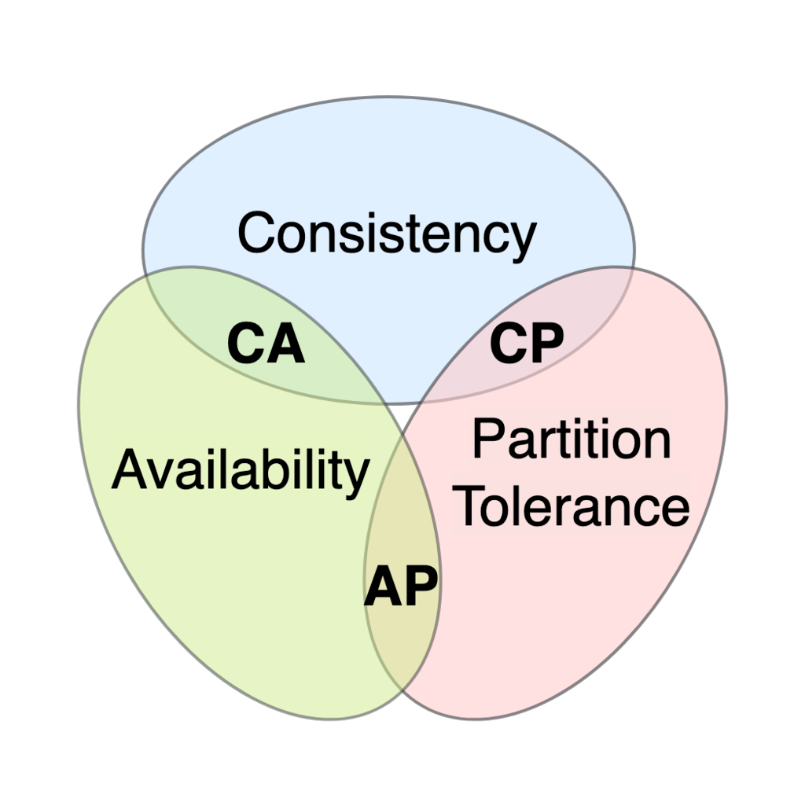

# 11. Strategie e pattern nei microservzi

Grazie allo sviluppo Agile e virtualizzazione/container ogni microservizio si scala indipendentemente. Tutto in modo distribuito.
I sistemi distribuiti non offrono out-of-box garanzie per quanto riguarda la consistenza.
Il teorema CAP dice che sia la consistenza che la disponibilità possono essere affrontante mediante meccanismo di replicazione. Un servizio può non essere raggiungibile per una questione di sovraccarico, non a causa di crash. La consistenza è data da repliche allineate.

Si cerca un livello di consistenza in base a cosa bisogna fare perché non vogliamo avere garanzie transizionali classici. I sistemi di gestori della persistenza sono diversi tra di loro che danno garanzie BASE (Basically Avaialable, Soft state, Eventual consistency).
Ogni singola operazione può avere esigenze diverse dal punto di vista della consistenza. Vi è dunque la soluzione BASE che è disponibile di base, stato leggero (attende che tutte le operazioni siano finite) e una eventuale consistenza.
Nei sistemi distribuiti vediamo concetti di safety (dà garanzia rispetto al fatto che un evento non previsto non avvenga) e liveness (dà garanzia che verrà un evento che si vuole venga eseguito).
La consistenza classica dice che l'informazione acceduta è l'aggiornamento in base all'ultima scrittura avvenuta.
Un sistema eventualmente consistente (EC) dice che se aggiorno un dato, prima o poi tutti vedranno quel dato aggiornato. Se vi sono repliche, in base al nodo replica, il dato potrebbe non essere stato aggiornato, però prima o poi lo sarà.
L'eventuale consistente forte (SEC) è la somma di EC e della consistenza classica (forte).

## Strategie di comunicazione
I message broker sono in genere transazionali. RabbitMQ, ad esempio, ha delle operazioni transazionali un po' lente. Le misure di reliability sono spesso:
- ACK di messaggi
- Code persistenti: i messaggi non vengono persi con (1) rendendo l'intermediario più robusto non tenendosi tutti i dati in memoria o (2) replicare l'intermediario
- Code replicate
Vi è comunque una garanzia di base: messaggio consegnato *al più* una volta. Un meccanismo di garanzia può essere il consumer ack: il broker tiene una copia del messaggio finché non riceve un ack dal destinatario, garantendo il messaggio *almeno* una volta. Un altro meccanismo è la publisher confirm, ed essa avviene perché presente nel log oppure, nel caso di pub replicati, quando è presente in tutte le repliche. Meno di queste cose si ha, meno sarà complesso.

L'affidabilità, data una media $N$ di servizi che comunicano in cui ogni servizio è denominato $A$, è $A^N$. Questo è dovuto dal fatto che i servizi comunicano tutti fra di loro in modo complesso. 