# 2. Processi business

Processo rivolto all'operabilità di una singola organizzazione. La gestione del processo business è una disciplina degli economisti che include concetti, metodi e tecniche volte al design, amministrazione, configurazione e analisi di esso.
Il processo di vita lo si descrive ciclicamente.

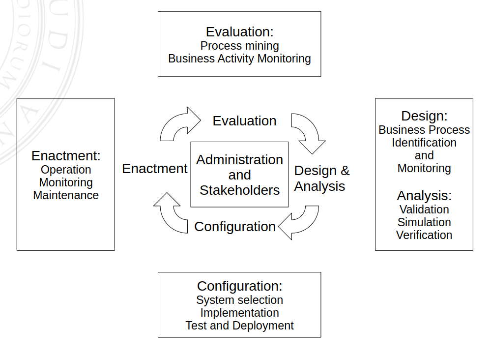

Le attività possono essere svolte da ingegneri, amministratori o dalle singole risorse umane. Bisogna costruire un framework tale che ogni processo sia capace di supportare attività mediante strumenti di IT. Devono tutti poter interagire definendo chi-fa-cosa.
Il ciclo di feedback continuo è dato perché nel tempo cambiano (1) l'operabilità e i servizi che si vogliono mantenere e (2) il personale che lavora a tali servizi.
I supporti IT possono coordinare i singoli processi.

## Workflow
Il **workflow** è l'automazione di un processo business, in tutto o in parte. Durante i processi si alternano delle attività che dipendono dai risultati di essi stessi. Le dipendenze causali sono definite in termini di generiche regole procedurali: determinano la coordinazione del processo in esecuzione. La gestione è fatta dai **workflow management system**, un software che definisce, crea e gestisce l'esecuzione dei workflow. Lo fanno mediante un software che esegue 1+ **workflow engine**, i tool IT e le applicazioni: è capace, in base a cosa serve, di richiamare i tool oppure, nel caso di HR, di interagire con le persone.
Un workflow può essere raffinato nel tempo perché va in un repository. Il repository interagisce col workflow engine. Una nuova versione del processo può andare a rompere l'utilizzo di un altro sistema, dunque si possono avere molteplici istanze. 

Un **work item** è un meccanismo centrale tra il sistema e le risorse umane. È inserito dentro una lista di cose da processare dal sistema. L'utente notifica il sistema di aver ricevuto il work item e si mette in attesa di una risposta di completezza. 

Gli stati di un work item sono definiti mediante lo schema seguente, perché il singolo work item può essere definito a un utente facente parte di un gruppo.
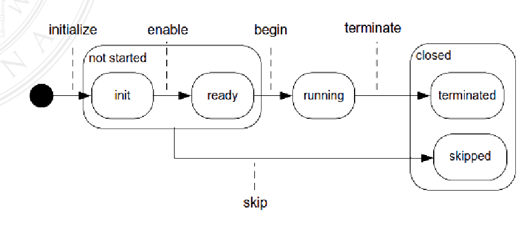

vi è anche un sistema di sospensione per ottimizzazione del processo.
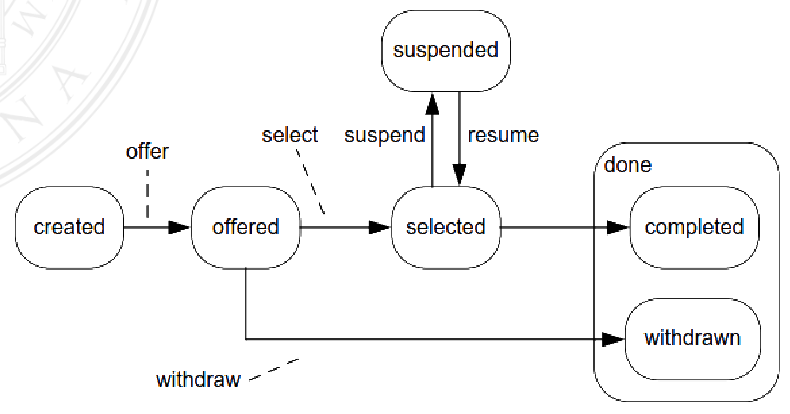

Il **business process management system** fa, essenzialmente, la medesima cosa. Gli *engine* si occupano di automatizzare le cose e gestire il monitoraggio. I workflow sono più incentrati sui processi di esecuzione. 

Un processo potrebbe andare da una parte piuttosto che un'altra in base al processo che crea dei rami divisi.
## BPMN
Cosa avviene all'interno del processo è definito mediante un modello. Un'istanza di un modello è l'effettiva esecuzione del modello. Il processo di gestione degli ordini è 1, mentre le istanze sono tutte le gestioni degli ordini che si portano avanti nell'organizzazione: spesso le istanze sono chiamate *casi*. 

Esempio di business process model per venditore/compratore:
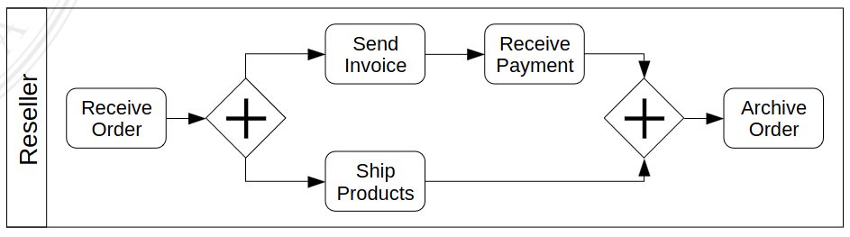
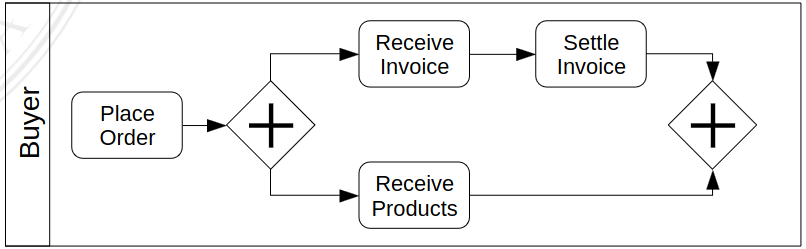

Si usa una metodologia grafica dato che non si usa solo per modelli di processi IT. Il rombo con la croce è un gateway che definisce una cosa da fare in contemporanea. Si ha una interdipendenza fra di essi. Sono due business process separati perché fanno riferimento a due organizzazioni separate. Questa sotto, per l'appunto, è chiamata *coreografia*.


Lo spettro di MOF, il framework su cui è costruito UML, identifica 4 livelli di astrazioni ed è usato per definire linguaggi basati su modelli. BPMN è un linguaggio basato su esso che riguarda la modellazione di un processo business. La notazione descrive il modello in maniera grafica.

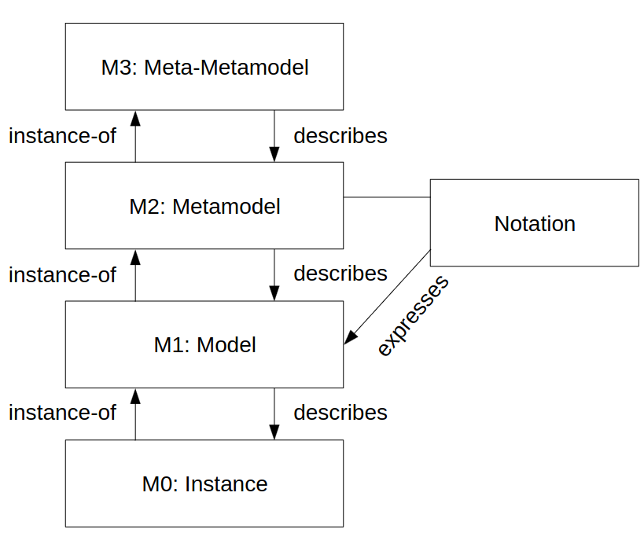

Il BP si correla con l'attività perché corrisponde ad un insieme di attività che vengono svolte da diverse parti come l'HR che lo fa senza supporto IT (Manual Activity) oppure sfruttando l'IT (UI Activity) oppure da sole IT (System Activity). Le attività manuali non vengono svolte dall'engine perché non possono essere svolte da attività automatiche. L'orchestrazione di servizi definisce servizi che possono essere totalmente automatizzati (System Activity): un caso speciale di system workflow in cui si espone un'interfaccia sotto forma di servizio.

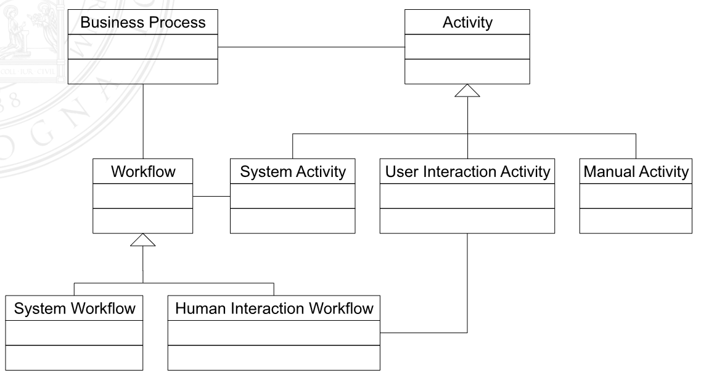

Un metamodello per un processo che si applica a UML definisce un insieme di nodi (attività o gestione del flusso o eventi) collegati da archi.

BPMN usa lo stesso standard XML per l'esportazione dei dati serializzati.

Esistono 4 tipi di diagrammi:
- processo: una sequenza di attività in un'organizzazione con l'obbiettivo di fare un lavoro;
- collaborazione: stesso del processo ma con interazioni tra 2+ organizzazioni sfruttando le pool e i messaggi;
- conversazione: semplificazione di sopra, non molto usato in pratica;
- coreografia: ci si concentra sui vincoli in cui 2+ organizzazioni interagiscono fra di loro.

### Diagramma di processo
Attraverso il diagramma di processo si definisce un flusso di esecuzione del processo che progredisce. Si ha una rete di elementi "flow object" collegati da "connecting object".
#### Flow object
##### Evento (cerchio)
- niente bordi: inizio. È facoltativo. Multipli start creano multipli flow concorrenti.
- bordo bianco: intermedio. Si dividono in quelli generati (generazione o ricezione di messaggi) o catturati (deviati da eccezioni). Throwing: non determina variazioni nella semantica del processo (il token non si ferma, passa avanti, ma succede qualcosa). Catching: duale del throwhing, hanno influenza sulla semantica di esecuzione del processo (tengono bloccato il token fino a che non avviene una determinata cosa).
- bordo scuro: fine. È facoltativo.

Gli eventi *boundary* associate ad attività che rappresentano esecuzioni alternative se avvengono l'evento. L'esecuzione viene più o meno interrotta e poi vengono generati altri token su altro ramo.
##### Gateway (rombo)
Gateway, controllori del flusso che procedono in parallelo o in modo condizionato.

- esclusivo (rombo vuoto o con x): punti di decisione, il flusso va in una o altra parte, in base ai dati del processo e dunque in automatico.
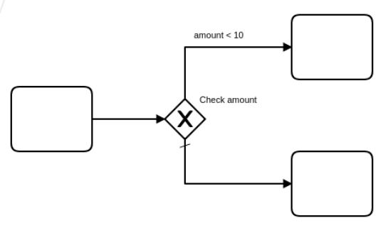

- parallelo (rombo con +): il processo è attivato in parallelo. Funziona in medesimo modo con due input: attende che siano eseguiti tutti gli input; è detto *join*.
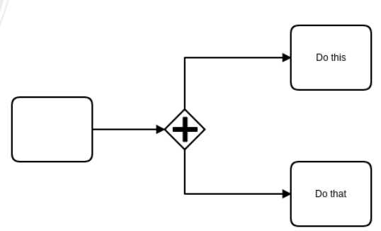

- esclusivo per eventi (rombo con pentagono): in base agli eventi che avvengono ed esegue poi in base a quello che avviene prima. Esempio di messaggio con timeout.
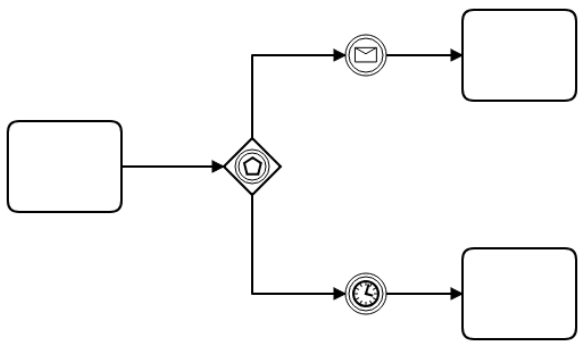

- inclusive (rombo con cerchio vuoto): una condizione su ogni ramo d'uscita, medesima cosa nel caso di molteplici rami in entrata piuttosto che in uscita. Non viene generato il token se la condizione nel ramo è falsa, ma questo in fase di esecuzione. Se, nell'esempio, la condizione del ramo centrale è falsa, il secondo inclusive attende solo l'esecuzione degli altri due.
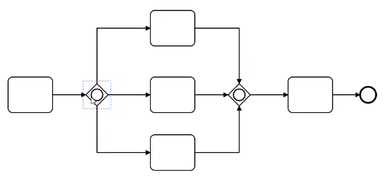

- complesso: modella situazioni in cui la semantica non è chiara dall'esecuzione e usa combinazioni di altri gateway.

I gateway possono essere impliciti ma facendo ciò si potrebbe creare ambiguità perché implicitamente si considera in modo *parallelo*.
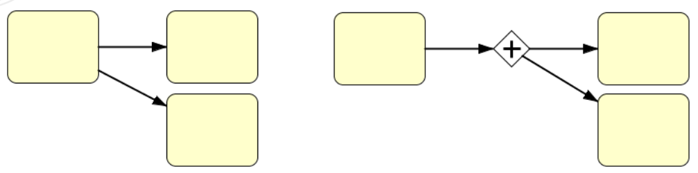

Medesima cosa per quelli entranti, ma li si considera esclusivo, o meglio, *simple merge* in questo caso.
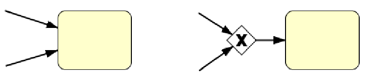

In caso di 1+ condizionali allora si ha un gateway inclusivo.
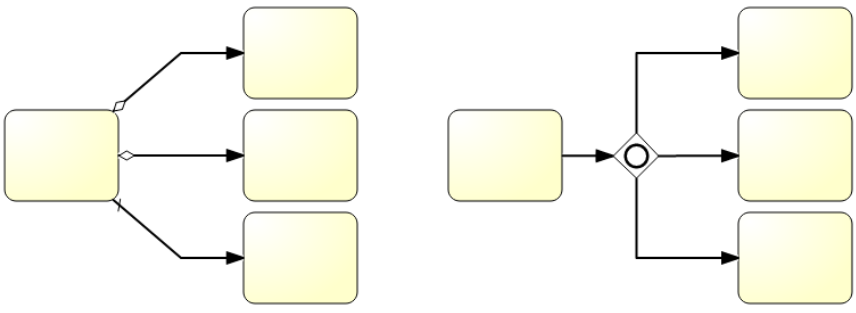

Se si ha un mix, si crea una cosa più complessa e poco intuitiva.
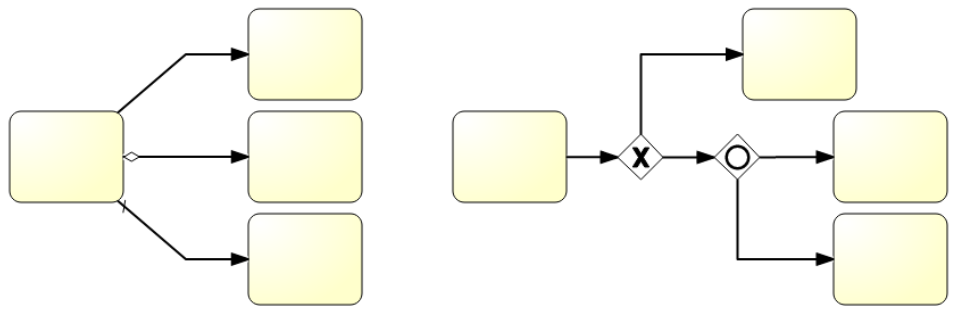

##### Attività (rettangolo)
- atomiche (task);
- sottoprocessi che possono essere ricorsivi;
###### Marcatori
Aggiunge ulteriore semantica, ad attività e task.
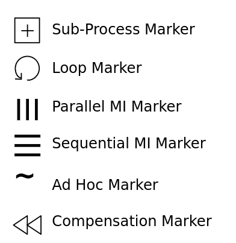

In quello parallelo si generano istanze parallele di quell'attività.
In quello ad-hoc vi sono più attività non collegate fra di loro.
###### Task
Definisce la natura delle azioni. Non sono associate a sotto processi.
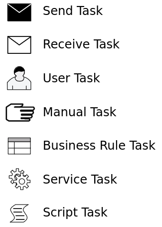

Nel *manual* è un'attività completamente non correlata dal sistema informativo: qualcuno lo esegue e poi non attende conferma o altro.
Nel *service* si definisce l'azione da un componente software mediante servizio.

Esistono dei processi reali dentro l'organizzazione che non sono in grado di modellare con questi linguaggi.
#### Connecting object
- freccia con punta colorata: *sequence flow* usato per le dipendenze, l'elemento a dx non si attiva se non finisce quello a sx. Possono essere condizionali.
- freccia con punta aperta: *message flow* usato per i messaggi fra due organizzazione diverse;
- freccia senza punta e tratteggiata: *association flow* decorazioni per aggiungere annotazioni, non influisce l'esecuzione del processo.

#### Artifatto
Aggiunge informazioni extra. Usate per far vedere i gruppi o semplici messaggi extra.

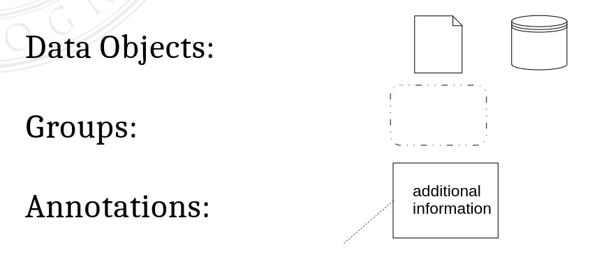

#### Messaggi
Dati della comunicazione. Busta bianca per le richieste, busta grigia per le risposte. Avvengono tra business process diversi.

#### Segnali
Tra sezioni dello stesso business process conviene usare i segnali. Il caso

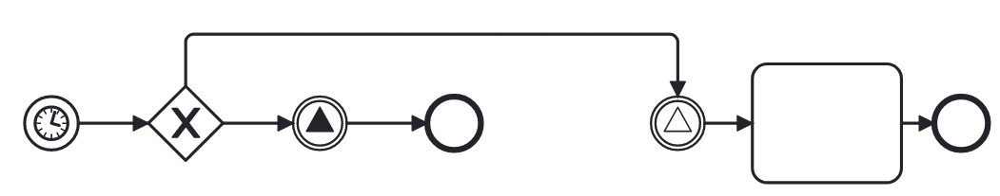

è il medesimo di fare

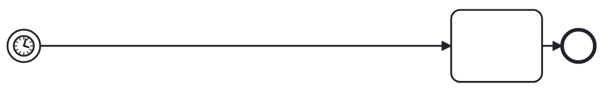

dunque ha più senso scrivere questo come

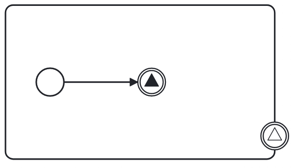

#### Pool e lame
Suddivisione del diagramma. Le seconde sono partizioni delle pool di una organizzazione: aree dell'organizzazione.
Una pool rappresenta un'organizzazione e può essere divisa dalle lame o come una black box. Le *sequence flow* vengono usate all'interno di una pool. 

Un processo termina quando tutti i *token* sono annullati, ma se usato il *terminate end event* allora il processo viene terminato a prescindere.

#### Eccezioni
Prima si tiene attenzione sui percorsi regolari. Le eccezioni sono divise per categorie:
##### Business exception
Chiare ed eseguite durante il processo. Si gestisce mediante un *exclusive* gateway o un messaggio.
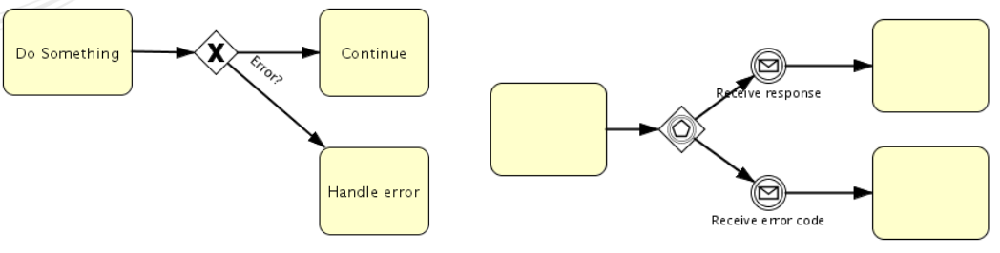
##### Partner exception
Qualcosa che è in relazione ad eventi esterni. Non sono necessariamente allineate con le mie attività (eg: annullamento dell'ordine). Si usano eventi *boundary*.
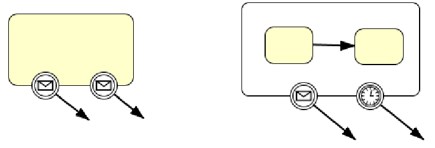
##### Timeout
È importante quando si considera il timeout. 
##### Errori di sistema
Rete caduta o altro, dunque si fan fatica a modellarlo. Anche qui si usano eventi *boundary*.

#### Transazione
Il fatto che determinate azioni possano non arrivare in porto con successo e a fronte di eccezioni, vuol dire che devono esserci delle compensazioni. Questo si può risolvere con le transazioni (simili a quelle fatte a db). Questo meccanismo automatico è fatto dentro un sottoprocesso che, se fallito, ritorna allo stato iniziale.
Si chiamano delle compensazioni (in modo esplicito) per ogni attività. Quest'ultime non sono dei reali eventi: se un elemento di un gruppo di attività fallisce, allora vengono ri-chiamate nell'ordine inverso; alla fine viene eseguito il ramo biforcato. In realtà l'attività può fallire anche dall'interno. I vari "undo" vengono chiamati **solo** se viene eseguito il *cancel*, tutti gli altri casi ignorano l'esecuzione degli "undo".
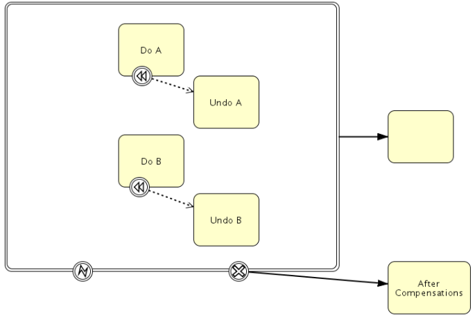

Quindi, in questo caso, verrebbero eseguite, nell'ordine inverso "Undo B" e "Undo A".
```
DoA -- DoB     ------>       UndoB -- Undo A
```

Un esempio di caso di prenotazione hotel/volo si vede come qui di seguito, anche se vengono ignorate le parti di rimborso.
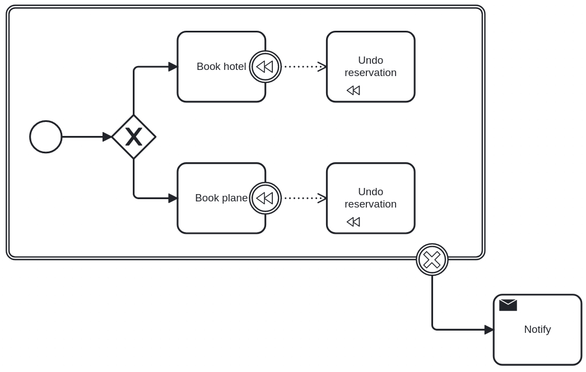

#### Stati
Un'attività si può anche trovare in stati di fermo, oltre che di pronto. Questo perché vi sono dipendenze di dati che il token potrebbe avere. Lo stato di completamento può essere considerato con successo o no. Cancellare un'attività può causare problemi in base allo stato in cui tale attività si trova.

#### Diagramma di coreografia
Specifica come una coreografia si sviluppa in termini di messaggi tra le parti. Si focalizza sui pattern usati tra i vari attori. Esse servono a definire dei contratti che vincolano i partecipanti a scambiare messaggi in una certa maniera.
Qui di seguito degli esempi delle due diverse tipologie di diagrammi.

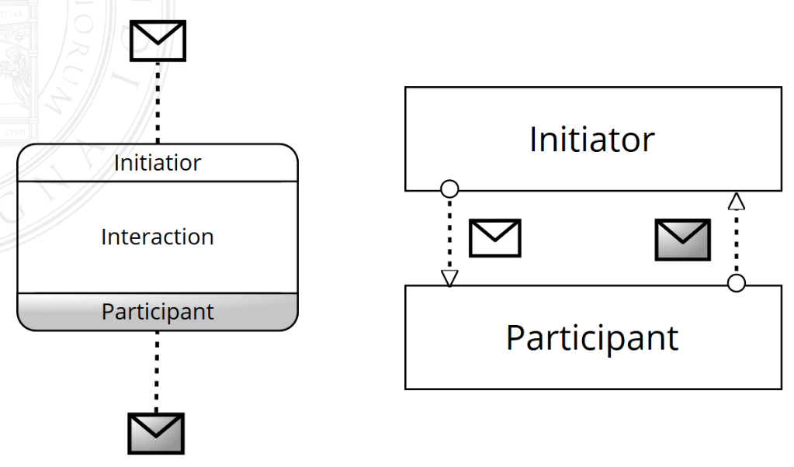

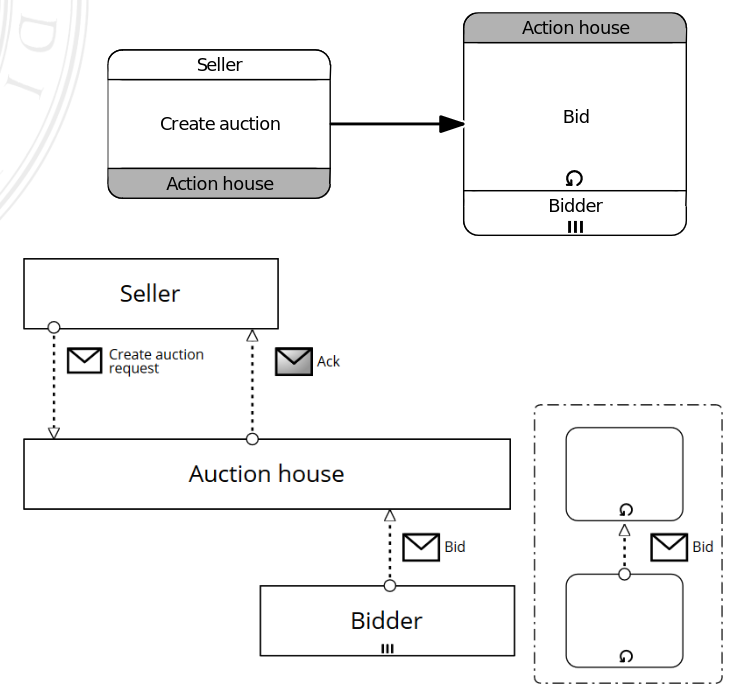 
Il fatto che vi sia un `|||` sotto il nome "Bidder", vuol dire che vi sono tanti "Bidder" che si comportano nel medesimo modo.

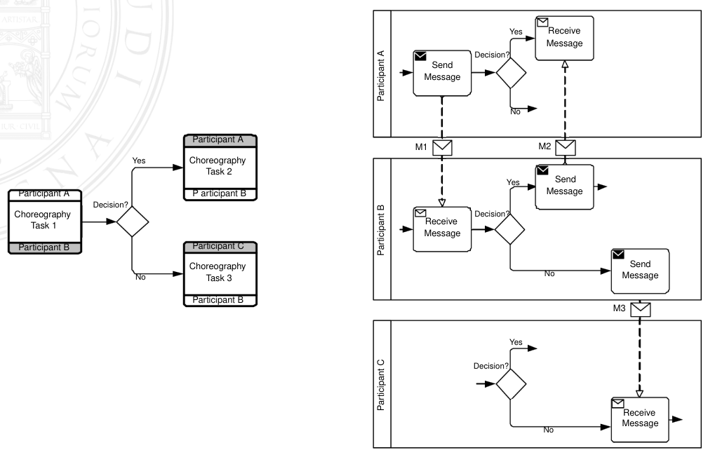 
Qui si ha una dipendenza nell'esecuzione, la quale è data dal fatto che deve prima eseguirsi il task 1. La "decisione" deve essere replicabile all'interno del processo di ogni partner che da lì in avanti può essere coinvolto.

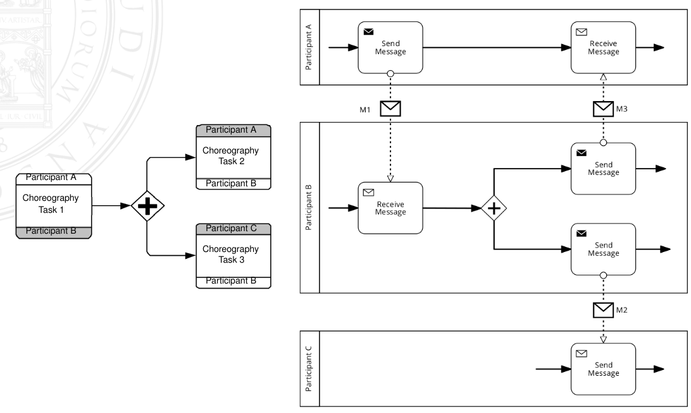

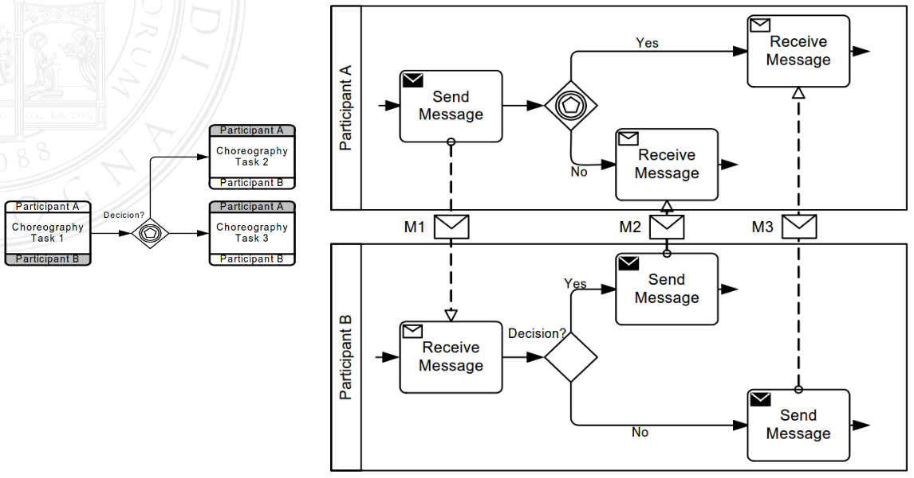

È possibile usare anche gli eventi, come il timeout. 
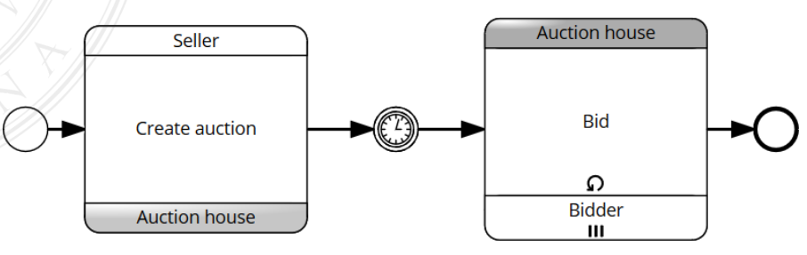

È possibile gestire sotto coreografie. Complessivamente, nell'esempio, i partner coinvolti sono 3. L'iniziatore è $B$ che spedisce un pacco $B \to C$.
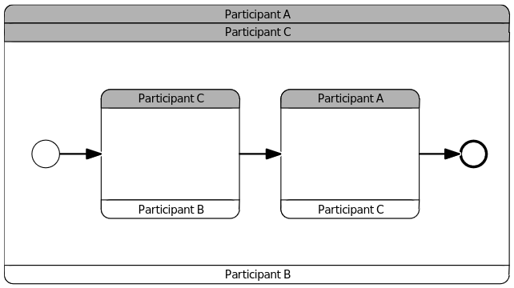
Nelle sub-coreografie vi è 1 solo bianco, che è l'iniziatore di tutto.

Si può rendere più esplicita la collaborazione tra le varie coreografie. La comunicazione dunque permette di mantenere il pattern di interazione con i partner esterni senza mostrare com'è strutturato il processo interno.

Le scelte devono essere coerenti per tutti i partner.